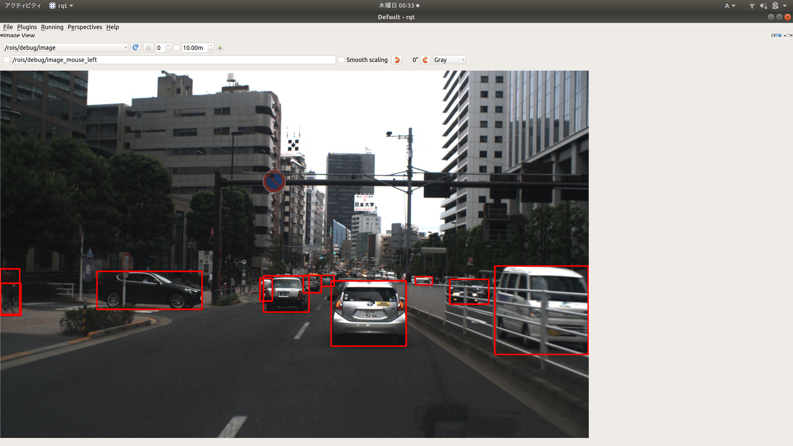

# ROS wrapper for TensorRT YOLOv4

## Referenced repositiory
Please check this repository for detail implementation.
The trained files are provided by the following repository. The trained files are automatically downloaded when you build.

https://github.com/lewes6369/TensorRT-Yolov3

https://github.com/wang-xinyu/tensorrtx

https://github.com/tier4/AutowareArchitectureProposal.git

## Trained model
- tranined file (608) :
  https://drive.google.com/drive/folders/1F3f2_CZTOIcuUhvubNaLlMoIx0_Pv6_x?usp=sharing

Please note that above repository is under MIT or Apache 2.0 license.

## Dependecies
- Ubuntu 18.04
- ros melodic
- cuda 10.2
- cudnn 7.6.5
- tensorrt 7.0.0

## How to use
1. install ros and colcon.
2. `mkdir -p workspace/src`
3. `cd workspace/src`
4. `git clone https://github.com/wep21/tensorrt_yolov4_ros.git`
5. `cd tensorrt_yolov4_ros && mkdir data`
6. Place trained models under data/.
7. copy msgs under src/ from https://github.com/tier4/AutowareArchitectureProposal/tree/master/src/common/msgs.
8. `cd workspace`
9. `colcon build --cmake-args -DCMAKE_BUILD_TYPE=Release --packages-up-to tensorrt_yolo4`
10. `source install/setup.bash`
11. `roslaunch tensorrt_yolo4 tensorrt_yolo4.launch`
12. Publish /image_raw by real camera or rosbag.
13. Check /rois/debug/image by rqt_image_view.

## Interface
### Input topic type
  `sensor_msgs::Image`
### Output topic type
  `autoware_perception_msgs::DynamicObjectWithFeatureArray`
